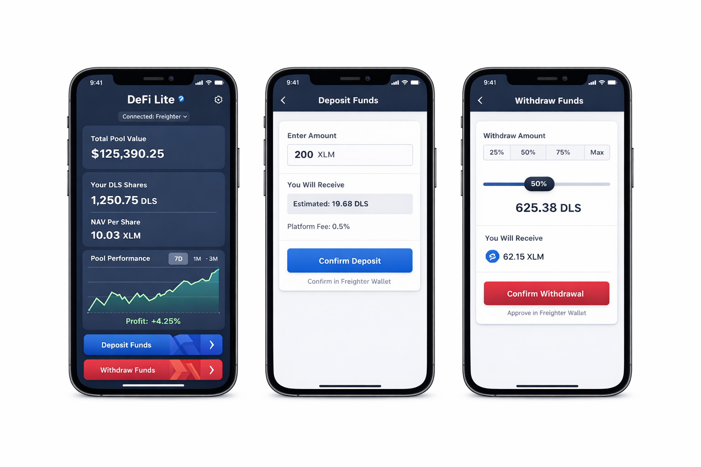

# DeFi Lite — Micro-Investment Pool on Stellar Soroban

A production-ready decentralized investment pool where users pool small investments and receive proportional ownership via pool share tokens (DLS).

## Screenshots

### Mobile View


## Architecture

```
┌─────────────────────────────────────────────────────────────┐
│                   Frontend (Next.js 14)                      │
│   Dashboard · Deposit · Withdraw · History · Pool Cards      │
│              Tailwind CSS · Recharts · Freighter             │
└──────────────────────────┬──────────────────────────────────┘
                           │ Stellar JS SDK
┌──────────────────────────▼──────────────────────────────────┐
│               Backend (Node.js / Express)                    │
│         /api/pool  ·  /api/analytics  ·  /health            │
└──────────────────────────┬──────────────────────────────────┘
                           │ Soroban RPC
┌──────────────────────────▼──────────────────────────────────┐
│                Soroban Smart Contracts (Rust)                │
│                                                              │
│  ┌─────────────┐   mint/burn   ┌──────────────┐             │
│  │   Pool      │◄─────────────►│  Token (DLS) │             │
│  │  Contract   │               │   Contract   │             │
│  └──────┬──────┘               └──────────────┘             │
│         │ on_deposit / update_pool_value                     │
│  ┌──────▼──────┐                                            │
│  │  Strategy   │  Conservative · Balanced · Aggressive       │
│  │  Contract   │  Simulates yield · Rebalances allocations   │
│  └─────────────┘                                            │
└─────────────────────────────────────────────────────────────┘
```

## Key Concepts

- NAV (Net Asset Value) = Total Pool Value / Total Shares
- Deposit: user sends XLM → receives DLS shares proportional to NAV
- Withdraw: user burns DLS shares → receives proportional XLM
- Profit/loss reflected in NAV per share (not share count)
- Platform fee: 0.5% on deposits and withdrawals (50 bps)

## Project Structure

```
├── contracts/
│   ├── pool/          # Core pool logic (deposits, withdrawals, NAV)
│   ├── token/         # DLS share token (mint/burn/transfer)
│   └── strategy/      # Asset allocation + yield simulation
├── frontend/          # Next.js 14 + Tailwind CSS
│   └── src/
│       ├── app/       # Next.js app router
│       ├── components/# UI components
│       └── lib/       # Stellar SDK helpers, wallet integration
├── backend/           # Express API (analytics, metadata)
├── scripts/           # Deploy + fund scripts
└── .github/workflows/ # CI/CD pipeline
```

## Deployed Contract Addresses (Testnet)

| Contract | Address | Stellar Expert |
|---|---|---|
| Pool Contract | `CA6EL6IVZHFIJJZHVNQY3SMOGIH356PZ25HCE76PSJ2U6MYHAH4KO52S` | [View on Stellar Expert](https://stellar.expert/explorer/testnet/contract/CA6EL6IVZHFIJJZHVNQY3SMOGIH356PZ25HCE76PSJ2U6MYHAH4KO52S) |
| Token (DLS) Contract | `CD7VEXDANHNX4MI7TKWJ7RFWELLNTPLDJFMAUSWAZV42IYNBDUBX5SD7` | [View on Stellar Expert](https://stellar.expert/explorer/testnet/contract/CD7VEXDANHNX4MI7TKWJ7RFWELLNTPLDJFMAUSWAZV42IYNBDUBX5SD7) |
| Strategy Contract | `CA5CKYJ3ZROVJDCW7WS7NHPORIFNGU4VNE7MT7BP5BORPCRJCDEUGPEL` | [View on Stellar Expert](https://stellar.expert/explorer/testnet/contract/CA5CKYJ3ZROVJDCW7WS7NHPORIFNGU4VNE7MT7BP5BORPCRJCDEUGPEL) |

## Setup Instructions

### Prerequisites

- [Rust](https://rustup.rs/) + `wasm32-unknown-unknown` target
- [Stellar CLI](https://developers.stellar.org/docs/tools/developer-tools/cli/install-stellar-cli)
- Node.js 20+
- [Freighter Wallet](https://freighter.app) browser extension

### 1. Install Rust WASM target

```bash
rustup target add wasm32-unknown-unknown
```

### 2. Build & test contracts

```bash
cd contracts
cargo test --all
cargo build --release --target wasm32-unknown-unknown
```

### 3. Deploy to testnet

```bash
# Create and fund a testnet account
stellar keys generate admin --network testnet
bash scripts/fund-testnet.sh $(stellar keys address admin)

# Deploy all contracts (outputs contract IDs)
bash scripts/deploy.sh
```

### 4. Configure environment

Copy the contract IDs printed by the deploy script into your frontend env file:

```bash
cd frontend
cp .env.local.example .env.local
# Edit .env.local and set:
# NEXT_PUBLIC_POOL_CONTRACT_ID=<pool contract id>
# NEXT_PUBLIC_TOKEN_CONTRACT_ID=<token contract id>
# NEXT_PUBLIC_STRATEGY_CONTRACT_ID=<strategy contract id>
```

### 5. Run frontend

```bash
cd frontend
npm install
npm run dev
```

### 6. Run backend

```bash
cd backend
npm install
npm run dev
```

## Demo Flow

1. Open `http://localhost:3000`
2. Connect Freighter wallet (testnet)
3. Click "Deposit Funds" → enter XLM amount → confirm in Freighter
4. View your DLS shares and current NAV in the dashboard
5. Watch NAV chart update as yield is simulated
6. Click "Withdraw Funds" → select percentage → confirm

## Smart Contract Interfaces

### Pool Contract

| Function | Description |
|---|---|
| `initialize(admin, token, strategy, name, fee_bps)` | One-time setup |
| `deposit(user, amount, asset_token) → shares` | Deposit and mint shares |
| `withdraw(user, shares, asset_token) → payout` | Burn shares and withdraw |
| `get_pool_info() → PoolInfo` | NAV, total value, shares |
| `get_user_position(user) → UserPosition` | User's shares and deposited value |
| `update_pool_value(caller, new_value)` | Admin/strategy updates pool value |

### Token Contract

| Function | Description |
|---|---|
| `mint(to, amount)` | Pool-only: mint DLS shares |
| `burn(from, amount)` | Pool-only: burn DLS shares |
| `transfer(from, to, amount)` | User-to-user share transfer |
| `balance(account) → i128` | Get share balance |
| `total_supply() → i128` | Total DLS in circulation |

### Strategy Contract

| Function | Description |
|---|---|
| `on_deposit(amount)` | Called by pool on new deposit |
| `rebalance(caller) → Allocation` | Rebalance to target allocation |
| `simulate_yield(admin, yield_bps) → i128` | Simulate yield and update pool |
| `get_allocation() → Allocation` | Current stable/growth split |
| `set_risk_level(admin, risk)` | Change Conservative/Balanced/Aggressive |

## Advanced Features

- Multiple risk pools (Conservative 4% / Balanced 8% / Aggressive 15% APY)
- Auto-rebalancing via `rebalance()` call
- Platform fee model (50 bps on deposit + withdrawal)
- Reentrancy guard on pool contract
- Proportional P&L via NAV (not rebasing)

## CI/CD

GitHub Actions runs on every push:
1. Rust contract tests (`cargo test`)
2. Frontend lint + type check + build
3. Backend build
4. Auto-deploy to Vercel on `main` branch

## Tech Stack

- Stellar Soroban (Rust) — smart contracts
- Next.js 14 + Tailwind CSS — frontend
- Stellar JS SDK — blockchain interaction
- Freighter — wallet integration
- Recharts — charts
- Express.js — backend API
- GitHub Actions — CI/CD
